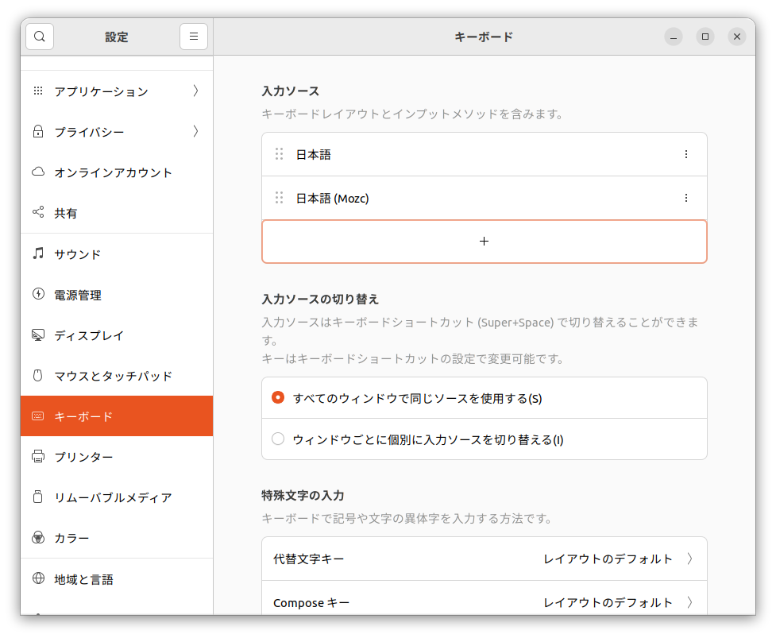
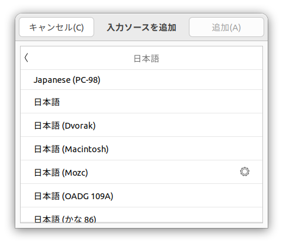

# Ubuntu セットアップ マニュアル Part3

## 初期設定と各種ツールの設定
Part2まででUbuntuのセットアップは終了しましたが、ここからはやった方がいい初期設定などを紹介していきます。

### リポジトリサーバの変更
*これは設定しなくても良いかもしれない。* 
初期設定では、`apt`用のリポジトリサーバが日本のサーバになっていない場合があります。外国のサーバのままだと物理的に距離が離れすぎているので、ダウンロード速度が低下することになります。もし日本のサーバになっていない場合は、日本のサーバを選択しましょう。 
詳細な設定方法は、 
[aptミラーサーバの設定(Ubuntu 上)](https://www.kkaneko.jp/tools/server/mirror.html) 
上記サイト(金子 邦彦研究室のWebサイトに公開されている資料)を参考にしてみてください。

### 日本語入力の設定
Ubuntuでも日本語入力用インプットメソッドを使用できます。ここでは**mozc**をインストールしてみます。Terminal上で、 
`sudo apt install ibus-mozc` 
としたあと、再起動します。そして設定アプリを開き、キーボード設定の入力ソースから日本語(mozc)を追加しましょう。 

 
図1　キーボード設定

 
図2　入力ソース

これで、日本語入力が可能になります。

### システムUIの日本語化
*この設定は任意です*

### Visual Studio Codeのインストール
Ubuntu Softwareアプリからインストールすることができます。
検索し、Visual Studio Codeをインストールしましょう。
(動画を見たほうが早いかもしれません。) 

お疲れ様でした、このファイルの内容は以上です。番外編を見てみてもいいですし、自分で色々と試してみてもいいでしょう。もし分からないことがあれば、どしどし聞いてください。  

Ubuntuや他のLinuxディストリビューション、またオープンソースアプリケーションなど、触っていると楽しいものです。皆さんも色々みてみて遊んでみませんか？
